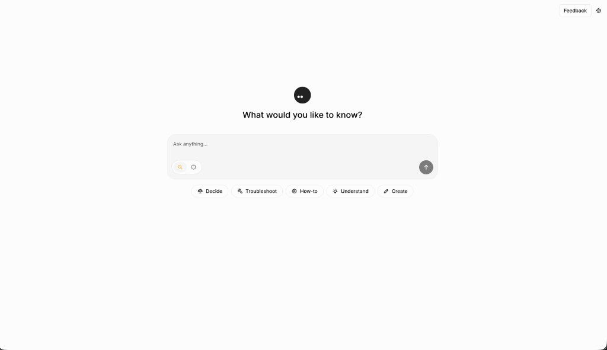
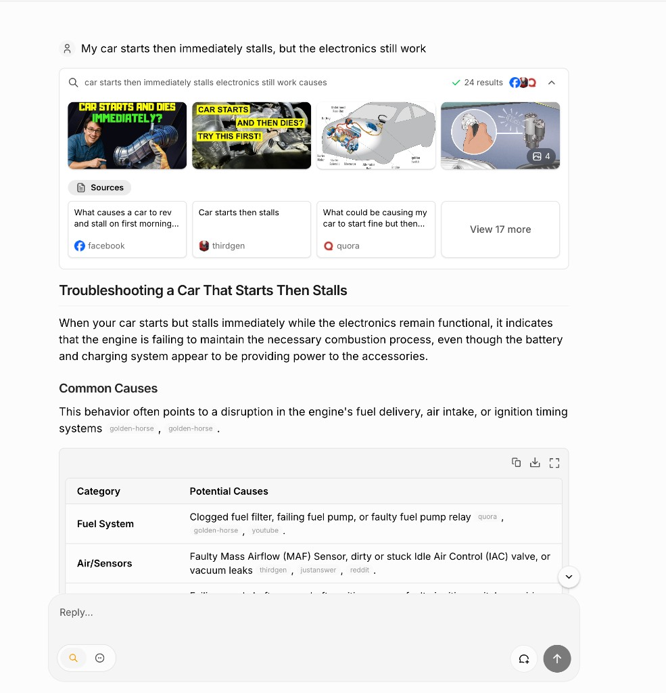
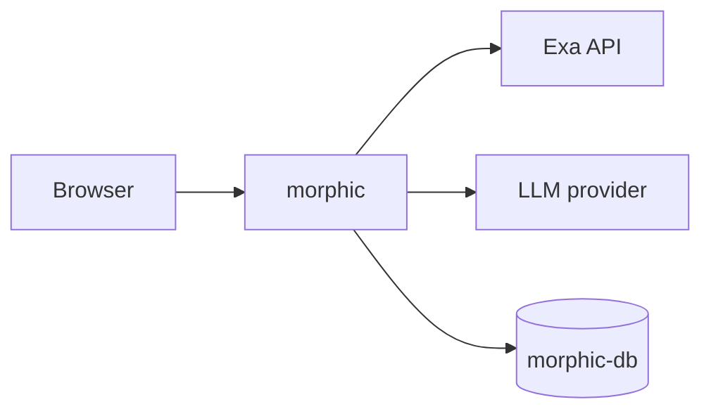

# Morphic on Render

> AI-powered search with a generative UI: grounded answers, cited sources, and rich inline components.

**Template branch:** [`render-templates`](https://github.com/ojusave/morphic/tree/render-templates) on [ojusave/morphic](https://github.com/ojusave/morphic)

Deploy [Morphic](https://github.com/miurla/morphic) on Render with a [`render.yaml`](./render.yaml) Blueprint: Docker build from `./Dockerfile`, managed PostgreSQL for chat history, and [Exa](https://exa.ai/) neural search. No self-hosted SearXNG or Redis in this variant.

**At a glance:** ~$31/mo (Oregon) · first deploy ~5–10 min · **Standard** web plan · `EXA_API_KEY` at Apply · one LLM key after deploy

---

## Deploy

1. Click **[Deploy to Render](https://render.com/deploy?repo=https://github.com/ojusave/morphic)** and connect the **`render-templates`** branch (or merge it to your default branch first).
2. On Apply, confirm `morphic` and `morphic-db`. Set `EXA_API_KEY`.
3. Wait for **Live** (~5–10 min). Migrations run on container start.
4. Add at least one LLM key in the Dashboard (`ANTHROPIC_API_KEY`, `OPENAI_API_KEY`, or `GOOGLE_GENERATIVE_AI_API_KEY`). Do not leave placeholder keys.
5. Open the **`morphic`** web service URL and pick a model that matches your LLM key.

New to Render? **[Sign up on Render](https://dashboard.render.com/register?utm_source=github&utm_medium=referral&utm_campaign=ojus_demos&utm_content=hero_cta)** first.

Upstream docs: [github.com/miurla/morphic](https://github.com/miurla/morphic) · live demo: [chat.morphic.sh](https://chat.morphic.sh)

---

## What's included

| Resource | Plan | Role |
|----------|------|------|
| `morphic` | Standard | Docker build from `./Dockerfile`, Exa search |
| `morphic-db` | basic-256mb | PostgreSQL 17 — chat history via Drizzle |

Default region: **oregon** (change in [`render.yaml`](./render.yaml)).

**Use it for:** research assistants · cited AI search · generative UI demos · internal knowledge exploration

---

## Environment variables

**Required at Apply:**

| Variable | Purpose |
|----------|---------|
| `EXA_API_KEY` | Exa neural search ([dashboard.exa.ai](https://dashboard.exa.ai/)) |

**Set after deploy (Dashboard):**

| Variable | Purpose |
|----------|---------|
| One LLM key | `ANTHROPIC_API_KEY`, `OPENAI_API_KEY`, or `GOOGLE_GENERATIVE_AI_API_KEY` |

**Wired in [`render.yaml`](./render.yaml):**

| Variable | Value / source |
|----------|----------------|
| `DATABASE_URL` | `morphic-db` connection string |
| `DATABASE_RESTRICTED_URL` | Same Postgres instance |
| `SEARCH_API` | `exa` |
| `ENABLE_AUTH` | `false` (anonymous single-user mode) |
| `ANONYMOUS_USER_ID` | `anonymous-user` |
| `NODE_TLS_REJECT_UNAUTHORIZED` | `0` (Render Postgres TLS workaround; no app code change) |

Optional overrides after deploy

See [.env.local.example](./.env.local.example) and upstream [CONFIGURATION.md](https://github.com/miurla/morphic/blob/main/docs/CONFIGURATION.md):

- **Multi-user auth:** `ENABLE_AUTH=true` + Supabase env vars
- **Different search:** `SEARCH_API=tavily` + `TAVILY_API_KEY`
- **File uploads:** Cloudflare R2 / S3-compatible vars

---

## Cost

| Resource | ~USD/mo |
|----------|--------:|
| `morphic` (Standard) | 25 |
| `morphic-db` (basic-256mb) | 6 |
| **Render subtotal** | **~31** |

Exa and LLM API usage are billed separately by those providers.

---

## Troubleshooting

| Problem | Fix |
|---------|-----|
| "We could not generate a response" | Set a real LLM key; remove any `OPENAI_API_KEY=REPLACE_ME` placeholder. Pick a matching model in the UI. |
| Search errors | Confirm `EXA_API_KEY` and `SEARCH_API=exa`. |
| Postgres / TLS errors in logs | Confirm `NODE_TLS_REJECT_UNAUTHORIZED=0` from the Blueprint is present on the service. |
| Deploy stuck / health check fails | Check logs for OOM. **Standard** plan is recommended for Next.js + AI workloads. |

More issues: [miurla/morphic issues](https://github.com/miurla/morphic/issues)

---

## Security & license

TLS at Render's edge. Postgres encrypted at rest on Render. Never commit API keys.

- **Morphic:** [Apache-2.0](https://github.com/miurla/morphic/blob/main/LICENSE)

---

  
  &nbsp;
  <a href="https://dashboard.render.com/register?utm_source=github&utm_medium=referral&utm_campaign=ojus_demos&utm_content=footer_link">
    Sign up on Render
  </a>
  &nbsp;·&nbsp;
  <a href="https://github.com/ojusave/morphic">GitHub</a>

